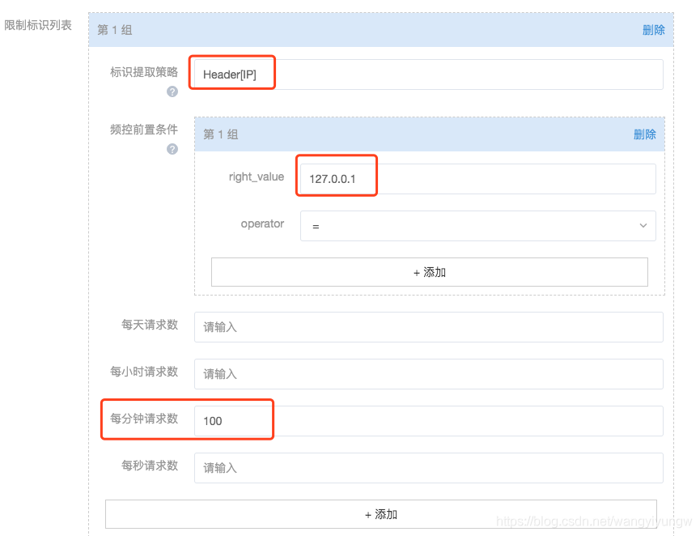
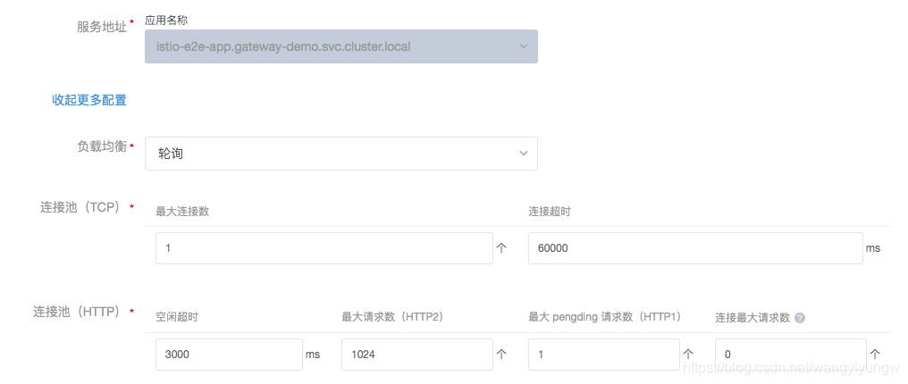

# Circuit breakers

熔断

## 方式

+ 异常点检测
+ 连接池配置

### 异常点检测

+ consecuitiveErrors:连续错误次数。对于HTTP服务，502、503、504会被认为异常，TPC服务，连接超时即异常
+ intervals：驱逐的时间间隔，默认是10秒
+ baseEjectionTime:最小驱逐时间。驱逐时间会随着错误次数增加而增加。即错误次数*最小驱逐时间
+ maxEjectionPercent:负载均衡池中可以被驱逐的实例的最大比例。以免某个接口瞬时不可用，导致太多实例被驱逐，进而导致服务整体全部不可用。

### 连接池配置

+ maxConnection
+ http1MaxPendingRequests
+ http2MaxRequests
+ maxRetries
+ connectionTimeout
+ maxRequestsPerConnection

#### 网易轻舟

## 参考资料

[网易轻舟平台](https://blog.csdn.net/wangyiyungw/article/details/105227611)
