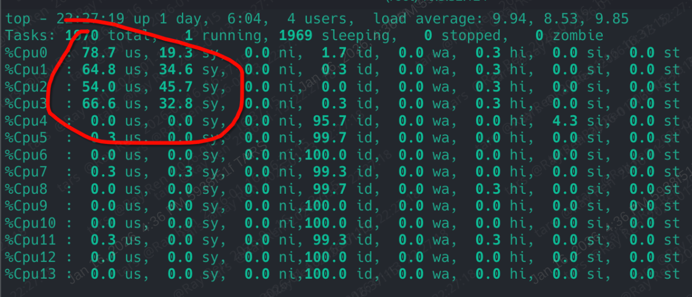
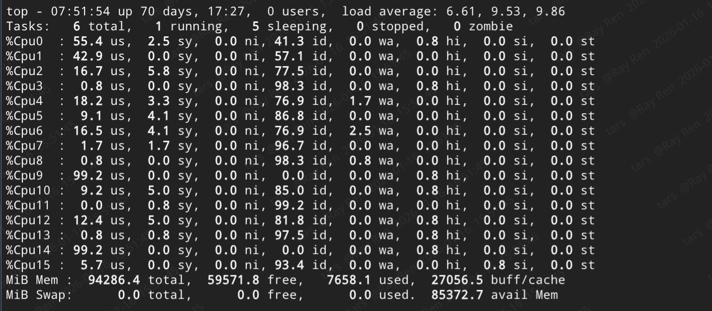
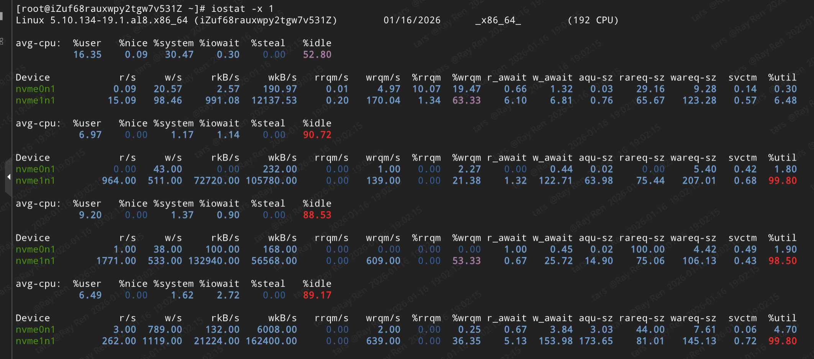
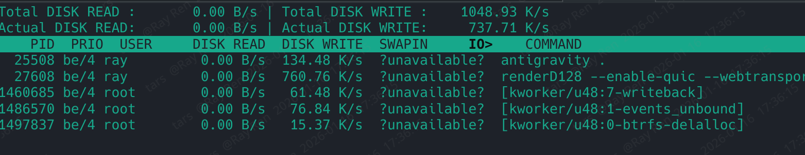
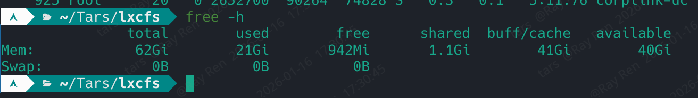
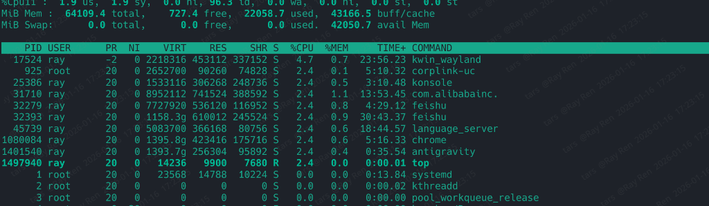
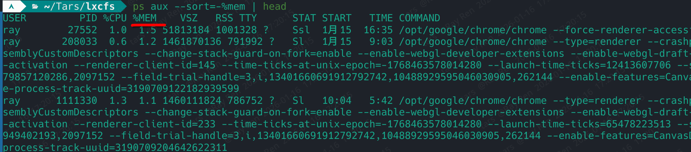

# CPU

## CPU性能观察

使用`top`, `htop`, `btop`进行监控

关注us(用户态), sy(系统态) wa(等待) 三个核心指标

us是用户态，sy是系统态，ni是nice，id是空闲wa是等待，hi是硬件中断，si是软件中断，st是偷窃

| 指标 | 缩写 | 含义 | 说明 |
| :--- | :--- | :--- | :--- |
| 用户态 CPU | `us` / `user` | 应用程序代码 | CPU 正在执行你的应用程序、脚本、服务逻辑等“实质性工作”。 |
| 内核态 CPU | `sy` / `system` | 操作系统服务 | CPU 正在执行内核代码，处理系统调用、硬件交互、内存管理、进程调度等“辅助性工作”。 |
| nice CPU | `ni` / `nice` | nice | CPU 被 nice（优先级）降低的进程占用。 |
| 空闲 CPU | `id` / `idle` | 空闲 | CPU 处于空闲状态，没有执行任何任务。 |
| 等待 CPU | `wa` / `iowait` | I/O 等待 | CPU 等待 I/O 操作完成，如磁盘读写、网络 I/O 等。 |
| 硬件中断 CPU | `hi` / `irq` | 硬件中断 | CPU 处理硬件中断，如设备驱动程序。 |
| 软件中断 CPU | `si` / `softirq` | 软件中断 | CPU 处理软件中断，如内核线程。 |
| 偷窃 CPU | `st` / `steal` | 偷窃 | 虚拟机监控器（如 KVM）从宿主机 CPU 中偷窃的 CPU 时间。 |

在 top 命令的输出中，如果 us (用户态) 占用很高，而 sy (系统态) 占用很低，通常确实代表了一种比较理想、高效的运行状态

1. 指标含义解析
指标   缩写   含义   说明
用户态 CPU   us / user   应用程序代码   CPU 正在执行你的应用程序、脚本、服务逻辑等“实质性工作”。

内核态 CPU   sy / system   操作系统服务   CPU 正在执行内核代码，处理系统调用、硬件交互、内存管理、进程调度等“辅助性工作”。

2. 为什么说“user 多，sys 少

这种情况通常说明利用率高、系统切换少，具体体现在以下两个方面：

*   ✅ 利用率高（做正事）：
    如果 us 占用很高（比如 80%~90%），说明 CPU 绝大部分时间都在运行你的应用程序（如 Web 服务器、数据库计算、视频转码等）。这意味着 CPU 的算力被充分用来产生业务价值，没有闲置浪费。

*   ✅ 系统开销小（切换少）：
    sy 占用低，说明 CPU 不需要频繁地陷入内核去处理系统调用、中断或进行上下文切换。这通常意味着：
    *   程序的逻辑比较连贯，不需要频繁向操作系统“申请资源”。
    *   没有发生频繁的进程/线程切换（上下文切换会消耗 CPU 做保存现场和恢复现场的工作）。
    *   I/O 操作（读写磁盘/网络）可能不多，或者效率很高（因为 I/O 通常会引发系统调用）。

3. 虽然这种状态通常是好的，但需要考虑两种特殊情况：

*   ⚠️ 单核 CPU 瓶颈：
    如果 us 接近 100%，而 sy 很低，说明这个进程把单个 CPU 核心“跑满了”。

*   ⚠️ 排除“死循环”干扰：
    如果 us 异常高（接近 100%），且 sy 极低，你需要确认是不是某个进程陷入了死循环。如果是死循环，CPU 一直在执行代码（所以 us 高），但并没有做有效的业务逻辑，这种“高利用率”其实是错误的。

4. wa高，说明I/O等待时间过长，这种也需要关注

CPU 正在专心致志地运行你的应用程序，没有被操作系统的管理开销（中断、调度、I/O 等待）所打扰，这是计算密集型任务的理想状态。 💪

### 技巧

`top` 按 `1`查看所有的核心
`top` 中按 `P`（大写）键，按 CPU 使用率排序，看看具体是哪个进程占用了大量的 us 时间

## IO

### iostat

`iostat -x 1` 查看 %util

以下是详细的数据分析：

#### 核心异常点分析

| 参数 | 数值 | 含义与现状 |
| --- | --- | --- |
| **`%util`** | **100.00** | **繁忙程度**。磁盘负载 |
| **`w_await`** | **287.21** | **写入延迟极高**。每个写入请求平均需要等待 **287 毫秒**。对于 NVMe 硬盘，正常的 `w_await` 通常应在 1ms 以下。 |
| **`aqu-sz`** | **215.98** | **队列深度过大**。有 215 个 I/O 操作正在排队等待处理。这说明 I/O 请求的速度远超磁盘的处理能力。 |
| **`wkB/s`** | **184268.00** | **写入吞吐量**。约 180MB/s。阿里云pl0的磁盘默认180MB/s |

---

### iotop

`iotop` 按 `P`（大写）键，按 CPU 使用率排序，看看具体是哪个进程占用了大量的 us 时间

## 内存

### free
`free -h` 总览

### top

`top` Shift + m 按照内存排序

#### 1. 进程列表中的内存字段

这里的字段是针对**单个进程**的统计：

* **VIRT (Virtual Image):** 等同于 `ps` 中的 **VSZ**。
* 表示进程申请的虚拟内存总量。

* **RES (Resident Size):** 等同于 `ps` 中的 **RSS**。
* **最关键指标：** 进程当前占用的**物理内存**。

* **SHR (Shared Memory):** 共享内存。
* 表示该进程与其他进程共享的内存大小（如公共库 libc.so）。
* 计算进程独占内存时，通常用 `RES - SHR` 估算。

* **%MEM:** 进程占用的**物理内存百分比**。
* 基于 `RES` 值与系统总内存的比值。

---

#### 2. 系统整体内存概览

* **MiB Mem:**
* **total:** 总物理内存 ( MiB)。
* **free:** 纯粹未被分配的空闲内存 ( MiB)。**注意：** 即使这个值很小也不代表内存不足。
* **used:** 已被程序正式消耗的内存 ( MiB)。
* **buff/cache:** 用于系统缓存和缓冲区的内存 ( MiB)。Linux 为了提速，会尽可能利用空闲内存缓存文件。

* **avail Mem:** **可用内存** ( MiB)。
* 这是真正能给新程序使用的内存量。它等于 `free` + 部分可回收的 `buff/cache`。

---

### ps

`ps aux --sort=-%mem | head`

#### 1. 核心字段深度解析

| 字段 | 全称 | 含义 | 为什么 Chrome 这个值很大？ |
| --- | --- | --- | --- |
| **%MEM** | Memory Percentage | 进程占用的**物理内存**百分比。 | 这是最直观的指标，反映了该进程对当前系统内存的消耗程度。 |
| **VSZ** | Virtual Memory Size | **虚拟内存**大小。包含进程能访问的所有内存（代码、库、已分配但未用、共享库等）。 | Chrome 采用多进程架构且大量使用共享库，VSZ 往往显示为天文数字（如你的数据中出现了  GB 甚至更多），但它**并不代表真实内存消耗**。 |
| **RSS** | Resident Set Size | **常驻内存**大小。这是进程当前实际占用的**物理内存**（单位通常是 KB）。 | **这是排查问题时最重要的指标。** 它包含了进程自身占用的内存和它使用的共享库内存。 |

---

#### 2. 注意：RSS 的“欺骗性”

在 Linux 中，RSS 有一个**陷阱**：如果你有 10 个 Chrome 进程，它们都加载了同一个 100MB 的共享库，那么这 10 个进程的 RSS 都会各计入这 100MB。

---

